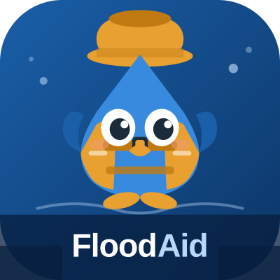
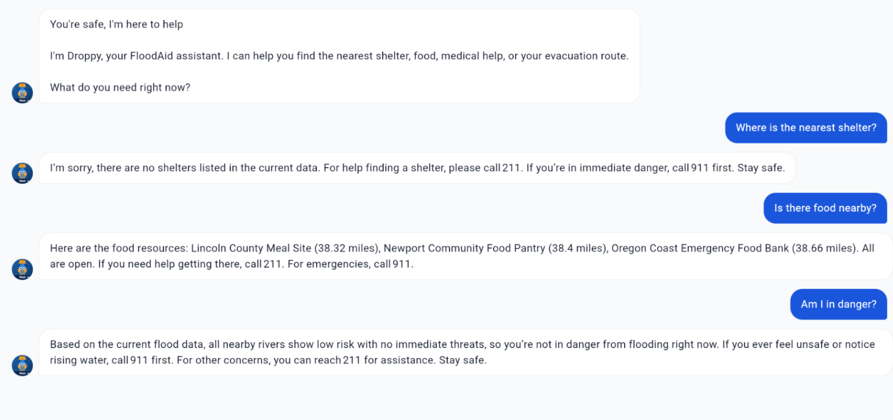
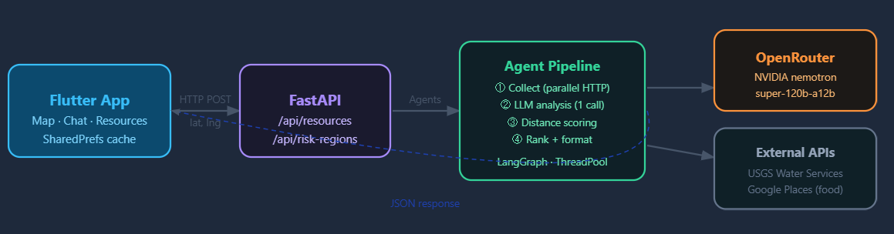
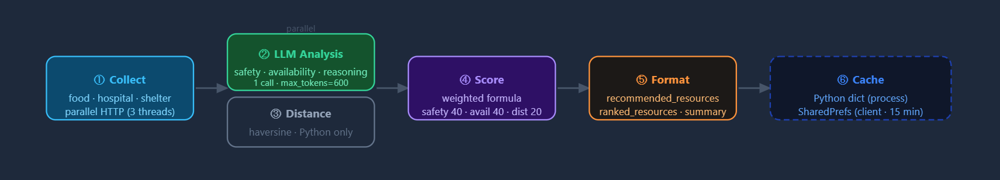

# FloodAid 🌊


AI-powered flood risk intelligence and emergency response coordination for communities across the United States.

## Overview

FloodAid is a hackathon-built multi-agent flood prediction and response platform that combines real-time hydrological data, weather forecasting, and spatial reasoning to assess flood risk and recommend safer evacuation routes and nearby emergency resources.

The system ingests live environmental signals from public government APIs and transforms them into actionable flood intelligence.


## Why FloodAid?

Every year, floods kill hundreds of Americans and displace hundreds of thousands more. When a flood warning hits, residents face a terrifying combination of:
* Information overload: too many alerts, maps, and news updates with no clear next step
* Decision paralysis: not knowing whether to stay, evacuate, or call for help
* Resource blindness: not knowing which shelters are open, which roads are safe, or where the nearest hospital is
* Emotional distress: fear and panic that make rational decision-making harder

Existing tools like weather apps and FEMA alerts tell residents that there is a flood. FloodAid tells them what to do about it, where to go, and how to get there safely, all while providing calm emotional support through our AI chatbot, Droppy.

## Features

### Interactive Flood Risk Map

Map screen loads user's GPS location to center risk map.

Flood risk is overlaid in color (green for safe, orange for moderate, red for high) over map.

Flood risk is computed using public APIs:
* Water level trend analysis
* Rainfall forecast severity
* Alert conditions

### Emergency Resource Finder

The resources tab calls backend in real time, passing user's GPS coordinates.
  
It returns a ranked list of hospitals, urgent care clinics, shelters, and food banks sorted by distance from user location. 

Each card shows the facility name, type, address, and distance in miles.

### Droppy — AI Support Chatbot

Droppy is a AI-powered support assistant.

Droppy is powered by the NVIDIA Nemotron API and uses a custom system prompt that injects user's real-time flood context: risk zone, river stage, nearest shelter.

Droppy provides calm and understanding guidance during stressful these stressful events.




## Architecture

### System architecture


### Agent process (per-call)



## Tech Stack

| Layer | Technology |
|----------|----------|
| Mobile Frontend | Flutter (Dart) |
| Map | flutter_map + OpenStreetMap |
| GPS | geolocator package |
| LLM | OpenRouter API (Nvidia Nemotron) |


## Data Sources
| API | Data | Description |
|----------|----------|----------|
| USGS Water Services API | Gauge stations and water levels | Gauge station locations for flood risk coverage network, water levels for risk analysis |
| National Weather Service (NWS) API | National Weather Service Data | Rain information and weather alerts for risk analysis |
| OpenStreetMap Overpass API | Hospital and other resources | For resources tab |


---

## Project Structure


```text
FloodAid/
├── backend/
│   ├── services/
│       ├── food_service.py     # Food bank finder
│       ├── hospital_service.py  # Hospital finder via Overpass API
│       ├── shelter_service.py   # Emergency shelter finder
│       ├── usgs_service.py      # USGS gauge lookup by bounding box
│       └── weather_service.py   # NWS alerts + hourly forecast
│   ├── agents/
│       ├── chat.py
│       ├── emergency_resource_agent.py  # Flood risk debate + scoring agents
│       └── risk_region_agent.py     # Resource ranking + prioritization agent
│   ├── tools/                  # LangChain @tool wrappers for agents
│   └── agent_response/          # JSON outputs saved from agent runs
│
├── frontend/
│   ├── floodaid/
│       ├── Lib/  
│           ├── main.dart              # App entry, MaterialApp setup
│           ├── map/
│               └── map_screen.dart    # GPS, map, risk banner, resource markers
│           ├── chat/
│               └── chat_screen.dart   # Droppy chatbot UI + NVIDIA Nemotron API
│           ├── resources/
│               └── resources_screen.dart # Resource list from backend
│           └── screens/
│               └── main_shell.dart    # Bottom nav (Map / Chat / Resources)
│       ├── assets/                    # Images, icons, Droppy mascot
│       ├── pubspec.yaml               # Flutter dependencies
│       └── android/ios/web/          # Platform-specific configs
├── iOS/                               # iOS native placeholder
├── start.sh                           # One-command startup for the whole app
└── README.md
```

---

## Installation & Setup
Prerequisites
Python 3.11 or higher
Flutter SDK (stable channel)
Git
1. Clone the repository
git clone https://github.com/Jeeya7/FloodAid.git
cd FloodAid

2. Backend setup
```bash
cd backend
# Install all dependencies
```bash
pip install -r requirements.txt

# Set up environment variables
cp .env.example .env
# Edit .env and add your OPENROUTER_API_KEY
```

3. Frontend setup
``` bash
cd frontend/floodaid

# Install Flutter packages
flutter pub get
```
## Running the App

From the root FloodAid/ directory:
``` bash
bash start.sh
```
This starts both the backend server and the Flutter app simultaneously. Press Ctrl+C to stop both.


## Hackathon

FloodAid was built in under 24 hours at BeaverHacks 2026 by a team of four students passionate about using AI for real-world impact. We chose floods because they are one of the most common and deadly natural disasters in the United States, and because existing flood apps tell you what is happening, but not what to do about it.

FloodAid changes that. It does not just show you a flood map. It reasons about your specific situation, finds the resources closest to you that are actually safe to reach, and guides you there with calm, human-centered language even if you are scared, even if you have never evacuated before.


### Vision
FloodAid aims to make flood intelligence accessible, interpretable, and actionable for both emergency responders and local communities.

Our long-term vision includes:

* National flood coverage
* Predictive watershed modeling
* Real-time alert subscriptions
* Community emergency coordination

---

## Team

| Name | Role |
|----------|----------|
| Jiya Pradhan | Developer |
| Jayasnehasree Sannidhi | Developer |
| Saranya Sounder Rajan | Developer|
| Ngoc Le | Developer |


---
<!-- 
## License

MIT -->
